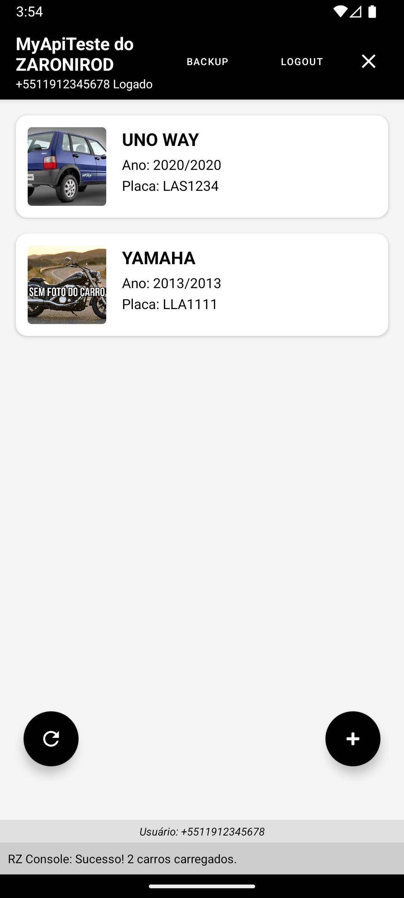
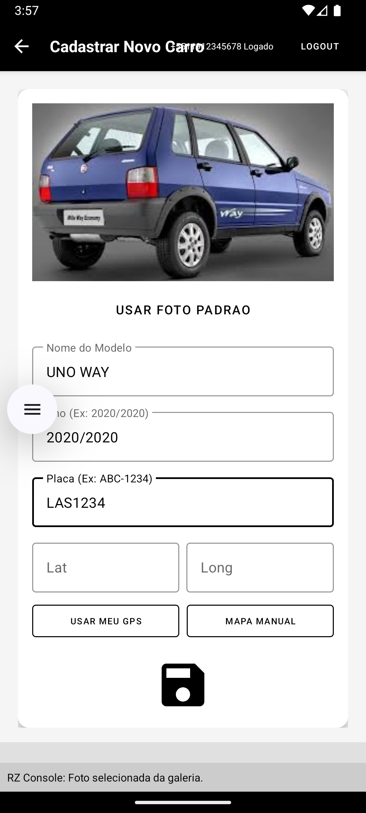
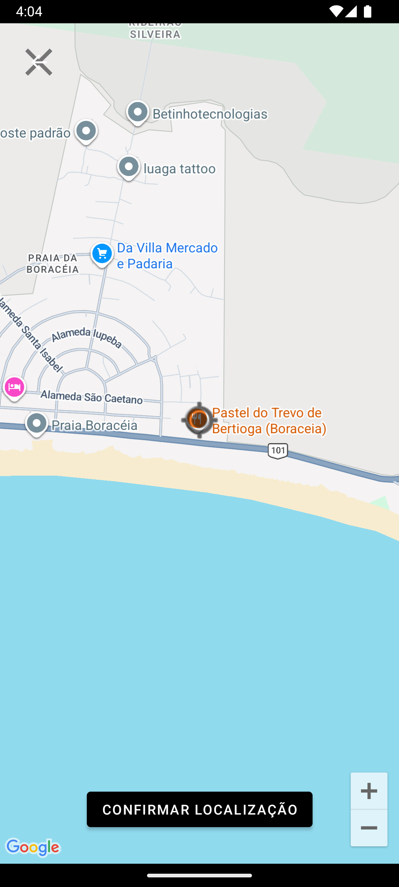

# 🚗 MyApiTeste - Gerenciamento de Frota (ZARONIROD)

Eu desenvolvi este aplicativo como projeto final para a pós-graduação na **UTFPR**. O objetivo é gerenciar uma lista de carros integrada a uma API REST local, utilizando o ecossistema Firebase para autenticação e armazenamento de imagens, além do Google Maps para geolocalização.

---

### 🚀 Minhas Funcionalidades Implementadas

Neste app, eu foquei em criar uma experiência fluida e completa (CRUD) com as seguintes características:

1.  **Autenticação Segura (Firebase Auth):**
    *   Implementei o login via **Telefone**. Configurei o Firebase para aceitar o número de teste `+55 11 91234-5678` com o código `123456`.
    *   Incluí uma opção de **Logout** acessível em todas as telas principais e um ícone de "Sair do App" que encerra completamente a aplicação.

2.  **Gestão de Carros (API REST + Retrofit):**
    *   O app consome uma API Node/Express para listar, cadastrar, atualizar e deletar carros.
    *   **Listagem Dinâmica:** Uso `RecyclerView` com `Picasso` para carregar as fotos e dados técnicos diretamente da API.
    *   **Tratamento de Erros:** O app identifica se o servidor está offline e exibe a mensagem: *"Verifique sua rede - sem acesso ao servidor"*.

3.  **Cadastro e Edição Completa:**
    *   **Upload de Fotos:** Ao cadastrar ou atualizar um carro, a foto é enviada para o **Firebase Storage**, gerando um link público que é salvo na API.
    *   **Ficha do Carro:** Permite editar modelo e ano. A placa (licence) é tratada como chave primária, exibida com destaque em fundo preto e protegida contra edição.
    *   **Hourglass (Feedback):** Implementei um overlay de carregamento ("ampulheta") em todas as operações de rede para que o usuário saiba que o sistema está processando.

4.  **Geolocalização (Google Maps SDK):**
    *   Integrei o Google Maps para exibir a localização exata de cada carro.
    *   **Mapa Manual:** Na tela de cadastro e edição, é possível escolher a localização arrastando o mapa. Como padrão, o mapa inicia no **Cristo Redentor (RJ)** caso nenhuma coordenada seja informada.
    *   **GPS:** Opção de capturar a latitude e longitude atual do dispositivo.

5.  **Sistema de Backup (Firestore):**
    *   Criei um botão exclusivo de **BACKUP** na tela principal.
    *   Ele realiza uma cópia de segurança de todos os itens da API para o **Cloud Firestore**, criando coleções datadas (ex: `rzcarapp_backups_20231027_1430`).
    *   O processo mostra o progresso em tempo real (etapas e erros) no overlay de carregamento.

---

### 📸 Galeria e Demonstração

Na pasta **`Fotos_videos_do_app_funcionando`**, você encontrará diversos prints de tela e um pequeno vídeo demonstrando o aplicativo em ação.

#### Telas Principais:
| Listagem de Carros | Cadastro de Novo | Seleção de Localização |
|:---:|:---:|:---:|
|  |  |  |

---

### 🛠️ Requisitos Técnicos Atendidos

*   **IDE:** Android Studio (Kotlin).
*   **API:** Integração via Retrofit com suporte a GET, POST, PATCH e DELETE.
*   **Firebase:** Authentication (Phone), Storage (Imagens) e Firestore (Backups).
*   **Imagens:** Carregamento otimizado com a biblioteca Picasso.
*   **Maps:** Google Maps SDK for Android.
*   **Configuração:** Centralizei as chaves de banco e URLs no arquivo `configuracoesapi.xml`.

---

### ⚠️ Como Rodar o Projeto

1.  **Firebase:** Adicione o seu `google-services.json` na pasta `app/`.
2.  **API Key:** Insira sua chave do Google Maps no `AndroidManifest.xml`.
3.  **Servidor:** Certifique-se de que a API Node/Express está rodando no endereço configurado em `res/values/configuracoesapi.xml`.
4.  **Firebase Console:** Certifique-se de ter criado o banco de dados Firestore com o nome `rzcarapp` (ou o nome definido no seu XML).

**RZ - Projeto revisado, refatorado e pronto para avaliação.**
